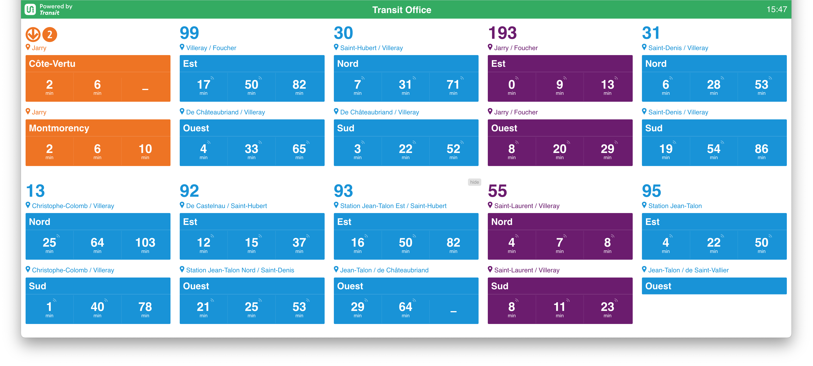

# RTA Real-Time display

A customized display system adapted from [TransitApp's Transit-TV](https://github.com/TransitApp/Transit-TV), used by the Greater Cleveland Regional Transit Authority (GCRTA) to show real-time departure information, alerts, and internal messages on facility screens.



> ⚠️ **Disclaimer**  
> This project was originally built by the Transit team as a demonstration of their Transit API. This customized version is maintained by GCRTA and comes with no guarantee of any kind.

---

## About This Version

This implementation includes several enhancements to better support GCRTA's operational needs:

- Custom layout and styling to reflect GCRTA branding
- Station-level configuration support
- Experimental configurable features
- Rotation of internal announcements and alerts

---

## Getting Started

### 1. Request API Access

Visit the [Transit API page](https://transitapp.com/apis) to request an API key.

Once you have your API key, place it in a `.env` file at the root of the project. Your .env file should look something like this:  

NODE_ENV=production
API_KEY=API_KEY_HERE

---

### 2. Test Locally

To run the project locally, ensure you have `node` and `pnpm` installed  
(we recommend using `nodenv` to match the `.node-version` file). Dev build uses mock data so API KEY not required.

```bash
pnpm i
pnpm build
pnpm dev
```

### 3. For Production

To run the project in production, ensure you have `node` and `pnpm` installed  
(we recommend using `nodenv` to match the `.node-version` file):

```bash
pnpm i
pnpm build
pnpm start
```